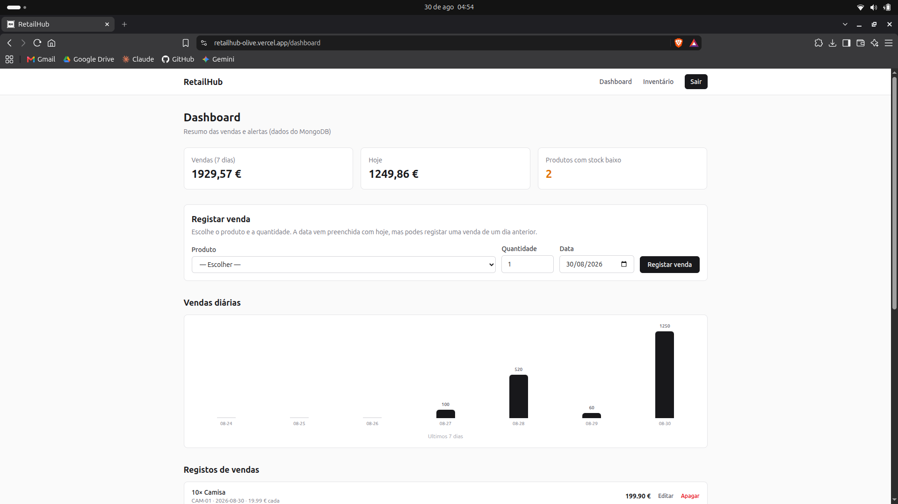
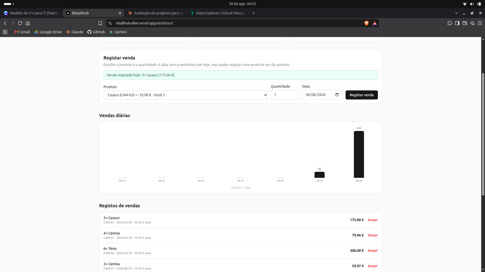

# RetailHub

Sistema de gestão de inventário e vendas para pequeno retalho. Centraliza produtos, stock e registo de vendas num só sítio, em vez de folhas de cálculo dispersas.

**Demo:** [retailhub-olive.vercel.app](https://retailhub-olive.vercel.app)

Para explorar sem criar conta, entra com o email `demo@retailhub.com` e a palavra-passe `demo12`.

## Ecrãs

**Dashboard** — totais da semana e do dia, alertas de stock baixo e gráfico das vendas dos últimos sete dias.

**Registos de vendas** — cada venda guarda o produto, a quantidade e o preço unitário. Editar ajusta o stock pela diferença; apagar devolve as unidades ao produto.

**Inventário** — CRUD de produtos com estado de stock.

## Funcionalidades

**Autenticação** — registo e login com palavras-passe encriptadas com bcrypt, sessão em JWT guardado em cookie httpOnly, e middleware que protege as rotas privadas.

**Inventário** — CRUD completo de produtos com nome, preço, SKU e quantidade em stock.

**Vendas** — registo de vendas que desconta o stock automaticamente e atualiza os totais do dia.

**Painel** — métricas do negócio e gráfico de vendas dos últimos sete dias.

**Alertas de stock** — sinaliza produtos com quantidade abaixo do limiar definido.

## Stack

| Camada | Tecnologia |
|---|---|
| Frontend | Next.js 16, React 19, TypeScript, Tailwind CSS 4 |
| Backend | Next.js Route Handlers |
| Base de dados | MongoDB com Mongoose |
| Autenticação | JWT com jose, bcrypt para as palavras-passe |

## Arquitetura

    retailhub/
    ├── app/
    │   ├── api/
    │   │   ├── auth/          registo, login e logout
    │   │   ├── products/      CRUD de produtos
    │   │   ├── sales/         registo de vendas
    │   │   └── dashboard/     métricas agregadas
    │   ├── dashboard/         painel principal
    │   ├── inventory/         gestão de produtos
    │   ├── login/
    │   └── register/
    ├── components/            componentes de interface
    ├── lib/
    │   ├── models/            schemas Mongoose
    │   ├── auth.ts            geração e verificação de tokens
    │   └── mongodb.ts         ligação à base de dados
    └── middleware.ts          proteção de rotas

A API vive nas Route Handlers do Next.js, o que mantém frontend e backend no mesmo projeto sem servidor separado. O middleware verifica o token em cada pedido a rotas protegidas, antes de a página renderizar.

## Correr localmente

Requisitos: Node.js 20 ou superior, e uma base de dados MongoDB (local ou no Atlas).

    git clone https://github.com/GabrielFBB/retailhub.git
    cd retailhub
    npm install

Cria um ficheiro `.env.local` a partir do `env.example`:

    MONGODB_URI=a_tua_string_de_ligacao
    JWT_SECRET=uma_chave_secreta_com_pelo_menos_32_caracteres

E arranca:

    npm run dev

Disponível em `localhost:3000`.

## API

| Método | Endpoint | Descrição |
|---|---|---|
| POST | `/api/auth/register` | Criar conta |
| POST | `/api/auth/login` | Iniciar sessão |
| POST | `/api/auth/logout` | Terminar sessão |
| GET, POST | `/api/products` | Listar e criar produtos |
| PUT, DELETE | `/api/products/{id}` | Editar e remover produto |
| GET, POST | `/api/sales` | Listar e registar vendas |
| GET | `/api/dashboard` | Métricas e dados do gráfico |

Todas as rotas de produtos, vendas e painel exigem sessão iniciada.

## Autor

Gabriel Borges — [github.com/GabrielFBB](https://github.com/GabrielFBB)
